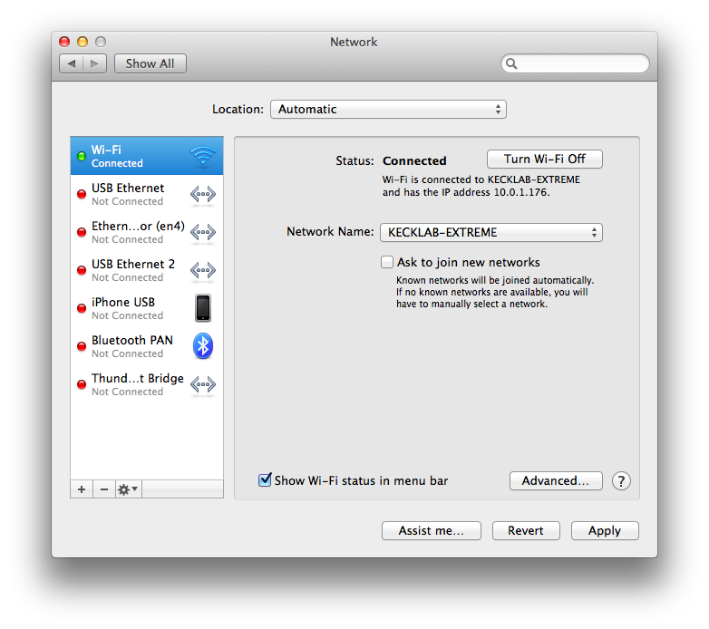

CSI: OS
========

## Mac OS X

#### Pre-OS software (firmware, I/O subsystem, boot loader, etc.)

Here we have an example of the EFI bootloader included with Mac OS X.

#### Kernel file(s)

Kernel file location found by grep.

#### Startup scripts and/or configuration files

Startup scripts and config files can be found in /etc on Mac OS X.

#### The "first" process

Launch daemon is the first process of Mac OS X.

#### Network settings

Network settings menu in Mac OS X.

## Linux (Ubuntu)

#### Pre-OS software (firmware, I/O subsystem, boot loader, etc.)

An example of GRUB, the bootloader for Ubuntu.

#### Kernel file(s)

Linux kernel folder found in /lib/modules.

> JD: Not quite—this is for kernel *modules*: they are indeed add-ons to the kernel, but not the kernel itself. Not a bad miss though.

#### Startup scripts and/or configuration files

Linux startup & config files found in /etc/init.

#### The "first" process

Used same UNIX shell command to find `init` to be first process.

#### Network settings

Ubuntu Linux network settings menu found in system settings.

## Windows

#### Pre-OS software (firmware, I/O subsystem, boot loader, etc.)

BIOS of a Dell Windows 8 personal computer.

#### Kernel file(s)

Location of kernel in C:/Windows/System32

#### Startup scripts and/or configuration files

Startup scripts can be viewed within Task Manager in Windows 8.1, instead of system configuration like previous Windows oeprating systems.

#### The "first" process

Used the `tasklist` command to determine the first process.

#### Network settings

Windows 8 Network Sharing Center settings menu.

