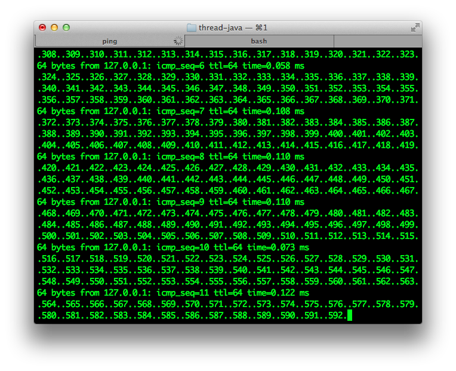
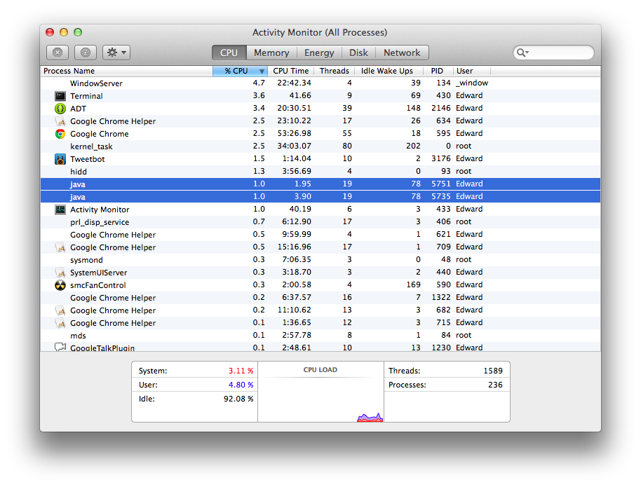
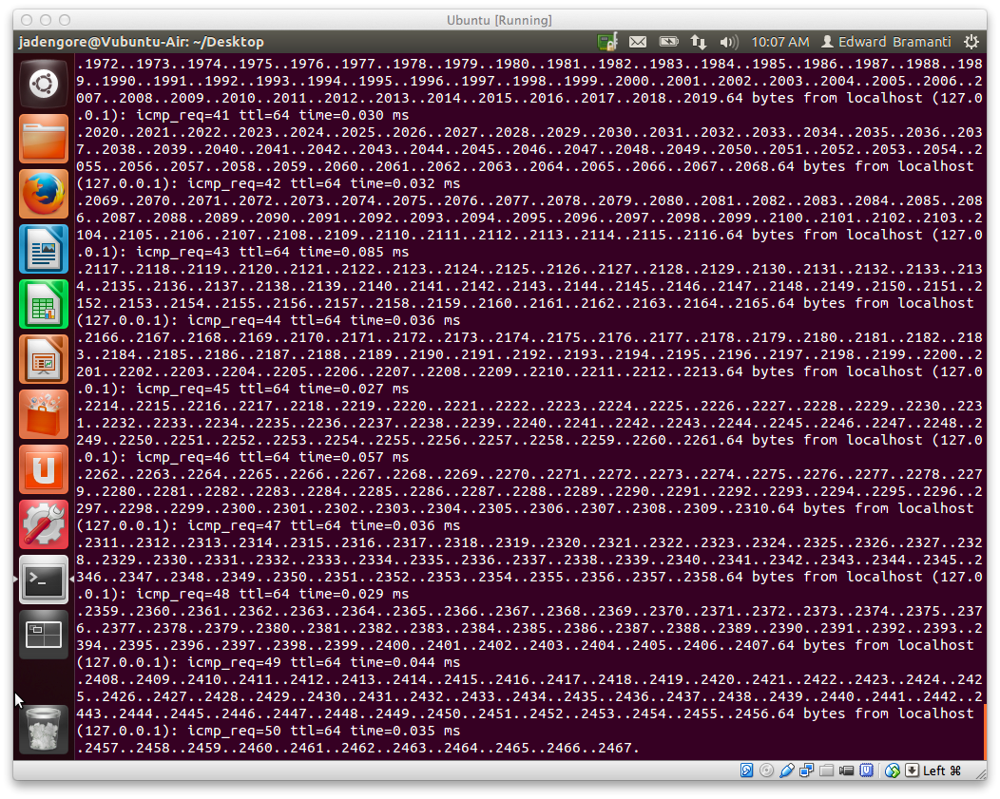
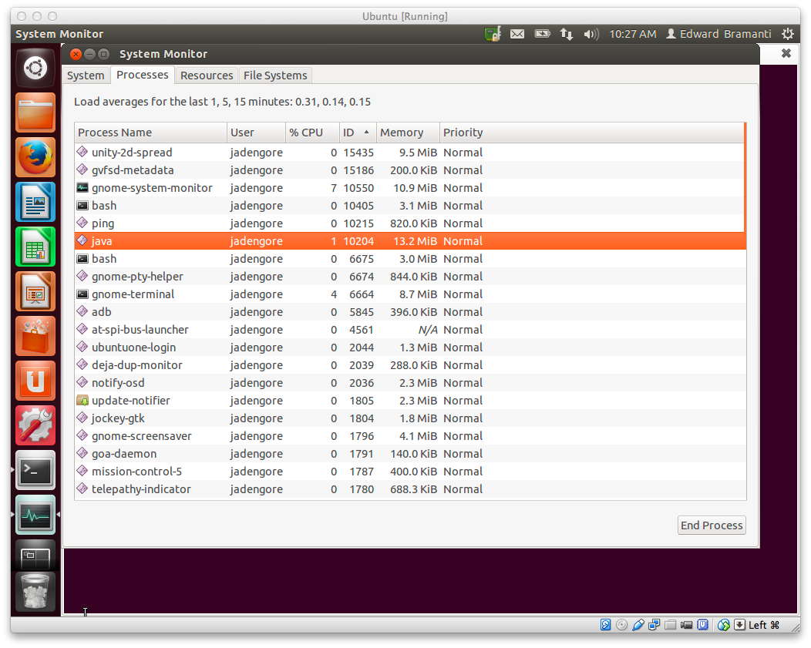
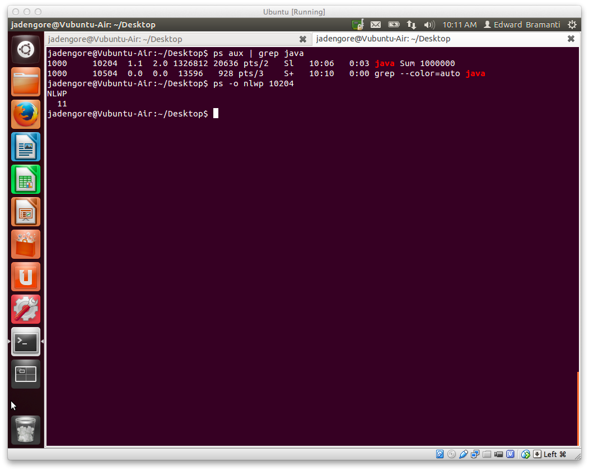

CSI: Process
============

Use long-running invocations (i.e., huge numbers) of the `thread-java` and/or `thread-posix` sample programs to do the following on at least two operating systems chosen from Linux, Mac OS X, and Microsoft Windows. The chosen two can be different for each task, depending on what is possible or easy for each operating system:

1. Invoke the long-running program, send it to the background, and run another program that produces output.Take a screenshot of that big hot terminal mess.

2. Invoke the long-running program, and use a process monitor on the operating system platform to see that program's threads. How do the different operating systems represent the threads? Note any major similarities and differences, accompanied by screenshot evidence.

####Mac OS

I ran `thread-java` on my Mac first, suspending the process temporarily with `CTRL-Z`. Next, I ran the command `bg && ping localhost` in order to send thread-java to the background as well as run the endlessly running `ping` command in the terminal as well. Screenshot below:

I opened up Activity Monitor, and found the command running under `java`. At the moment I checked it, it had 19 threads, which is given in the Activity Monitor of OS X. I believe it is showing two in my case because I cancelled and ran again after mistyping my command.

> JD: You may have had another one running that you overlooked—had you really "cancelled" the
>     other one, then that process should have quit.  But either way, GG, you spotted some
>     OS-level evidence of thread action.
>
>     But why just one summation?  Didn't you want to watch like 5-10 concurrent summation
>     threads going at it at the same time? `:)`

####Linux

Next, I ran `thread-java` on an Ubuntu virtual machine. I used a very similar process, I invoked the command `java Sum 1000000` and then suspended the process temporarily with `CTRL-Z`. I then ran the same command as on Mac, `bg && ping localhost`, to send the Sum to the background and then `ping localhost`as well. Screenshot below:

I used both Ubuntu's GUI and the command line as an Activity Monitor. I first took a look at the process ID for java in the graphical user interface provided by Ubuntu. It differs from Mac because it does not provide a thread count. Screenshot below:

To find the thread count, I knew I needed to use the command line. I called `ps aux | grep java` as extra practice for figuring out the process ID. I found that it returned two values: both the grep call and the actual process we need, `java Sum`. It was clear that the PID was `10204`. I then used the command `ps -o nlwp 10204`, and this allowed me to see the amount of threads running for the sum process. It turned out to be 11.

> JD: You got off to a good start here and certainly made some headway, but even more
>     information would have been staring at you had you dug into what an "LWP" was
>     even more.  There's a nice nugget in there that I was hoping you would find.