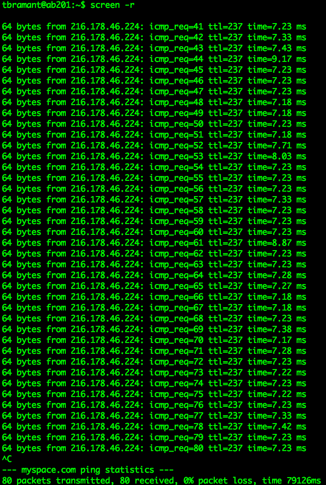

I/O Gymnastics
==========

##1. Create an `ssh` tunnel from this computer to a service that is visible from another `ssh`-capable computer (but, of course, not necessarily visible from the computer you’re using). Then, access that service from your computer through localhost and the tunneled port number. 

    ssh -L 2001:my.cs.lmu.edu:80 tbramant@my.cs.lmu.edu

####Submit a screenshot of your successful connection to the remote service via the tunnel.

This is the screenshot of what happened when I accessed localhost:2001/~tbramant/ in my browser.

> JD: This screenshot would be more compelling if you actually included the location bar saying `localhost:2001/~tbramant/`.  Because, you know, that could have come from anywhere :)

##2. Run something lengthy (`ping`, `vm_stat/vmstat`, loooooong download, finding the quadrillionth prime number...) inside `screen`; logout of that computer entirely, login again, and reconnect to `screen` to prove to yourself that the process has continued to run without interruption.

    ssh tbramant@my.cs.lmu.edu
    tbramant@my.cs.lmu.edu's password: 
    screen
    CTRL + AD
    [detached from 5410.pts-3.ab201]
    CTRL + D
    logout
    Connection to my.cs.lmu.edu closed.

    ssh tbramant@my.cs.lmu.edu
    tbramant@my.cs.lmu.edu's password:
    screen -r

Submit screenshots of your long-running command before you logged out, then after you reconnected to it.

##3. Learn how to use du, which tells you how much disk space you’re using in a given directory.

####• Which first-level subdirectory in ~ is taking up the most space? Submit the command that includes this information in as little output as possible.

First, I ran the command `du -d 1` to show the first-level subdirectories only. Then, I sorted the usage numerically in reverse order, putting the biggest directory on top. I chose the second line after realizing that the largest file will always be the root directory; therefore, the second largest will be the most space in the first level. Finally, `awk` allows for just the folder name to print out.

    du -d 1 | sort -n -r | sed -n '2p' | awk '{print $2}'

Output
    
    ./Downloads

####• Submit a command that displays only the disk usage of directories matching some regular expression. Hint: `|`.

I used `du -sh` to represent this output in human-readable format, since showing the amount of space matters. Then I just used a simple grep command to act as a regular expression, in this case, a simple one that can only return a match of cmsi371.

    Edwards-MacBook-Air:CMSI Edward$ du -sh * | grep cmsi371
    
Output

    1.3M    cmsi371

##4. On a Keck lab machine, create a file within ~. Run ls -i to determine that file’s inode number. Move this file to another directory inside ~, then move it to /tmp, then move it back to your home directory. After each move, use ls -i to see its inode number.

####• Submit the output of ls -i both right after you created the file and after each file move.

    tbramant@ab201:~$ vim xfile.txt
    tbramant@ab201:~$ ls -i
    14165319 mystery1.o                    14165832 xfile.txt
    tbramant@ab201:~$ mv xfile.txt ~/Documents
    tbramant@ab201:~$ cd Documents/
    tbramant@ab201:~/Documents$ ls -i
    14158180 CMSI186           14164799 CMSI284    14165832 xfile.txt
    tbramant@ab201:~/Documents$ mv xfile.txt /tmp
    tbramant@ab201:~/Documents$ cd /tmp
    tbramant@ab201:/tmp$ ls -i
    1972432 hsperfdata_mmalefyt  1973019 xfile.txt
    tbramant@ab201:/tmp$ mv xfile.txt ~
    tbramant@ab201:/tmp$ cd ~
    tbramant@ab201:~$ ls -i
    14165319 mystery1.o                    14165768 xfile.txt

####• Submit the piped commands that you would type in order to filter out all lines of ls -i’s output except for the file that you created.

    tbramant@ab201:~$ vim testfile.txt
    tbramant@ab201:~$ ls -i | grep testfile
    14165831 testfile.txt
    tbramant@ab201:~$ mv /~/testfile.txt /~/Desktop/testfile.txt
    tbramant@ab201:~$ mv testfile.txt ~/Desktop/
    tbramant@ab201:~$ cd Desktop/
    tbramant@ab201:~/Desktop$ ls -i | grep testfile
    14165831 testfile.txt
    tbramant@ab201:~/Desktop$ mv testfile.txt /tmp/
    tbramant@ab201:~/Desktop$ cd /tmp
    tbramant@ab201:/tmp$ ls -i | grep testfile
    1973019 testfile.txt
    tbramant@ab201:/tmp$ mv testfile.txt ~
    tbramant@ab201:/tmp$ ls -i | grep testfile
    tbramant@ab201:/tmp$ cd ~
    tbramant@ab201:~$ ls -i | grep testfile
    14165768 testfile.txt

##5. Pop a few storage devices (CD, DVD, flash drive, network drive, etc.) into your computer. Figure out the mount points for each device.

Command

    mount | grep Volumes

> JD: The Volumes prefix is valid only on Mac OS X. Other operating systems use something different.

####Submit the output provided by the command.

Output

    /dev/disk1s2 on /Volumes/REFIT (hfs, local, nodev, nosuid, journaled, noowners)
    /dev/disk1s1 on /Volumes/UNTITLED 1 (msdos, local, nodev, nosuid, noowners)
    /dev/disk3s2 on /Volumes/VirtualBox (hfs, local, nodev, nosuid, read-only, noowners, quarantine, mounted by Edward)
    /dev/disk4s1 on /Volumes/UUI (msdos, local, nodev, nosuid, noowners)
